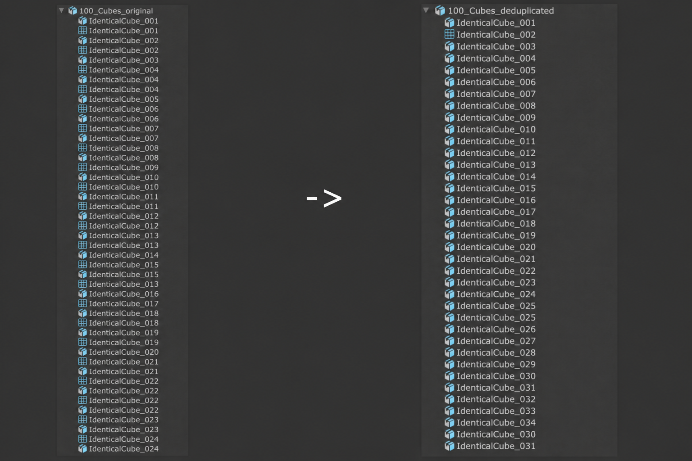
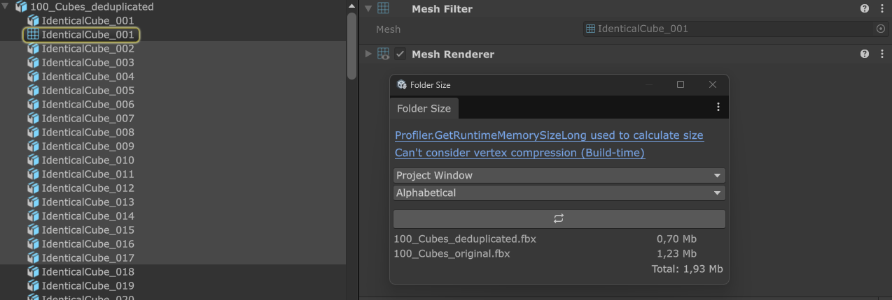

# Remove Mesh Duplicates Importer
Unity UPM-package that removes identical meshes from a model and replaces them with one original to save disk space (build size) and runtime RAM.






By default, Unity imports repeated objects from one FBX only as separate Mesh assets. In environment scenes, it is common to place many repeated meshes (vegetation, props, etc.) in a DCC package. The resulting duplicate meshes increase the size of the build on disk and the amount of mesh data kept in memory.

This package analyzes meshes during model import and reuses one mesh asset whenever the imported geometry is equivalent.

In addition, it can recognize equivalent meshes whose vertices were rotated around a different pivot in the 3D package, which is useful when an instance rotation was baked into the mesh.

Processing is opt-in per FBX model. This keeps the importer safe for projects where mesh reuse is not appropriate.

## Features

- Reuses identical meshes by comparing vertex positions, normals, tangents, colors, UV channels, bone data, bind poses, and submesh topology/index data.
- Detects vertex-rotated equivalents, reuses the representative mesh, and applies the required local rotation to the target object.
- Temporarily controls importer settings that can make rotated meshes compare differently, including mesh compression and vertex-order optimization, then restores the original settings after import.
- Provides a searchable hierarchy of mesh objects with per-object processing rules, including multi-selection and descendant propagation.
- Stores settings in the FBX `ModelImporter.userData`, so each model can keep its own configuration.
- Offers optional diagnostic logging for matches, rejected rotated comparisons, unique meshes, and processing time.
- Adds a shortcut button to the FBX Model Importer inspector header

### Example results

Actual savings depend on the source asset and importer settings. In two environment imports, the observed file sizes were:

| Asset | Before | After |
| --- | ---: | ---: |
| Tokyo | 32 MB | 10 MB |
| Nur_GP | 168 MB | 115 MB |
| 100 Cubes | 1.3 MB | 0.7 MB |
These figures are examples, not guaranteed compression ratios.

For a convenient before/after comparison inside Unity, install [Folder Size Window](https://github.com/mitay-walle/com.mitaywalle.folder-size-window).


## Installation

Or add the package through **Window > Package Manager > + > Add package from git URL**.

```text
https://github.com/mitay-walle/com.mitay-walle.remove-mesh-duplicates-importer.git
```

## Samples

The package includes a `100 Identical Cubes` sample with original and deduplicated FBX variants containing the same 128 identical cube meshes in different positions, rotations, scales, and materials. Install it from Unity Package Manager to test mesh reuse.


## Usage

1. Select a model in the Project window.
2. Press the button in the FBX Model Importer inspector header.
3. Enable identical mesh reuse and, when appropriate, vertex-rotated mesh reuse.
4. Use the object list to exclude specific mesh objects from processing.
5. Enable logging when you need import diagnostics.
6. Click **Save Settings And Reimport**.
7. Compare model sizes with Folder Size Window or in the build size report.

The settings are stored per FBX in `ModelImporter.userData`. When rotated mesh reuse is enabled, the tool temporarily applies comparison-friendly importer settings and restores the original values when processing finishes.

## Requirements

- Unity 2021.3 or newer
- Tested with 6000.3.7f1

## Known Issues

- Unity displays the warning `Importer inconsistent result` after importing a processed FBX model because meshes are removed.
- If duplicate meshes were already used somewhere externally, you will lose those references. Recovering references is out of scope.
