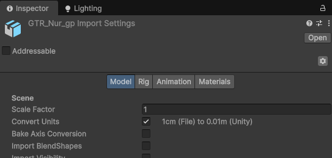
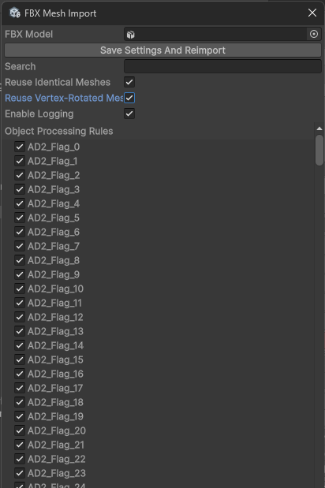

# Remove Mesh Duplicates Importer

## Summary

`Remove Mesh Duplicates Importer` reduces the disk and memory footprint of FBX assets that contain many repeated mesh instances.

By default, Unity can import repeated objects from one FBX as separate mesh assets. In environment scenes, this is common for baked vegetation, props, and other objects placed in a DCC package. The resulting duplicate meshes increase the size of the FBX on disk and the amount of mesh data kept in memory.

The tool analyzes meshes during model import and reuses one mesh asset whenever the imported geometry is equivalent. It can also recognize equivalent meshes whose vertices were rotated around a different pivot in the 3D package, which is useful when an instance rotation was baked into the mesh data.

Processing is opt-in per FBX model. This keeps the importer safe for projects where mesh reuse is not appropriate.

## Features

- Reuses identical meshes by comparing vertex positions, normals, tangents, colors, UV channels, bone data, bind poses, and submesh topology/index data.
- Detects vertex-rotated equivalents, reuses the representative mesh, and applies the required local rotation to the target object.
- Temporarily controls importer settings that can make rotated meshes compare differently, including mesh compression and vertex-order optimization, then restores the original settings after import.
- Provides a searchable hierarchy of mesh objects with per-object processing rules, including multi-selection and descendant propagation.
- Stores settings in the FBX `ModelImporter.userData`, so each model can keep its own configuration.
- Offers optional diagnostic logging for matches, rejected rotated comparisons, unique meshes, and processing time.
- Adds a shortcut button to the FBX Model Importer inspector header and a menu item at `Tools > GTR > Remove Mesh Duplicates Importer`.
- Editor-only package with no runtime assembly.

### Example results

Actual savings depend on the source asset and importer settings. In two environment imports, the observed file sizes were:

| Asset | Before | After |
| --- | ---: | ---: |
| Tokyo | 32 MB | 10 MB |
| Nur_GP | 168 MB | 115 MB |

These figures are examples, not guaranteed compression ratios.

For a convenient before/after comparison inside Unity, install [Folder Size Window](https://github.com/mitay-walle/com.mitaywalle.folder-size-window).





## Installation

Install through Unity Package Manager using the Git URL:

```text
https://github.com/mitay-walle/com.mitay-walle.remove-mesh-duplicates-importer.git
```

Or add the package through **Window > Package Manager > + > Add package from git URL**.

### Usage

1. Select an FBX model in the Project window.
2. Open `Tools > GTR > Remove Mesh Duplicates Importer`, or use the button in the FBX Model Importer inspector header.
3. Enable identical mesh reuse and, when appropriate, vertex-rotated mesh reuse.
4. Use the object list to exclude specific mesh objects from processing.
5. Enable logging when you need import diagnostics.
6. Click **Save Settings And Reimport**.

The settings are stored per FBX in `ModelImporter.userData`. When rotated mesh reuse is enabled, the tool temporarily applies comparison-friendly importer settings and restores the original values when processing finishes.

## Requirements

- Unity 2021.3 or newer.
- The Unity Model Importer module included with the Editor.

## Documentation screenshots

The screenshots above show the FBX importer integration, the object-processing rules window, and the kind of size comparison this tool is intended to improve.

## License

Released under the MIT License. See [LICENSE](LICENSE).
